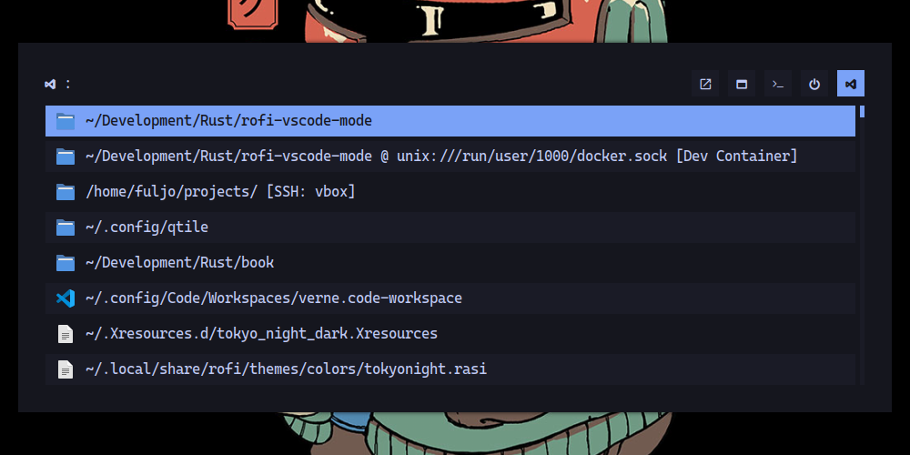

# VSCode mode for Rofi

[](https://github.com/fuljo/rofi-vscode-mode/actions)


A very handy Rofi menu to open recent Visual Studio Code workspacess and files.



This is a sort-of-clone of [rofi-code](https://github.com/Coffelius/rofi-code), with a few differences:
- it is implemented in Rust rather than Go
- it implements an ad-hoc mode for Rofi, rather than using its drun interface
- it shows exactly the items from VSCode's _File->Open Recent_ menu (see [below](#how-it-works) for more details)

A standalone command line tool called `vscode-recent` is also provided, to be paired with [dmenu](https://tools.suckless.org/dmenu/), [fzf](https://github.com/junegunn/fz) or similar.

Supports [Visual Studio Code](https://code.visualstudio.com), [Code - OSS](https://github.com/microsoft/vscode) and [VSCodium](https://vscodium.com). I also provide a standalone executable

Many thanks to [@Coffelius](https://github.com/Coffelius) for inspiring this project and to [@SabrinaJewson](https://github.com/SabrinaJewson) for providing Rust bindings for Rofi's C plugin interface.

## Install

### Build from source
You can choose to build and install only the `vscode-recent` tool, only the plugin or both.

First clone this repository
```sh
git clone https://github.com/fuljo/rofi-vscode-mode
```

Then get [Rust](https://www.rust-lang.org/tools/install) as you prefer.

Then install the needed dependencies
```sh
# Ubuntu / Debian
apt-get install \
  build-essential pkg-config libsqlite3-dev \
  rofi-dev libpango1.0-dev  # only needed for the rofi plugin

# Arch
pacman -S \
  make pkg-config sqlite \
  rofi # only needed for the rofi plugin
```

Then run `make` according to your choice:
```sh
# Binary and plugin
make install

# Binary only
make install.bin

# Plugin only
make install.plugin
```

## Usage

### As a Rofi mode
This library introduces a new mode named `vscode-recent`.
You can run it standalone with the command
```sh
rofi -show vscode-recent -modi vscode-recent
```
or add it to your default _modi_ in `~/.config/rofi/config.rasi`, like so
```
configuration {
	modi: "drun,run,window,vscode-recent";
    show-icons:                 true;
	drun-display-format:        "{name}";
	window-format:              "{w} | {c} | {t}";
}
```

I highly reccommend assigning a keyboard shortcut for this; for example I use <kbd>Mod</kbd> + <kbd>C</kbd> to run `rofi -show vscode-recent` (after adding it to my default modi).

When an item is selected, press:
- <kbd>Enter</kbd> to open it
- <kbd>Shift</kbd>+<kbd>Del</kbd> to permanently delete it from the list

:warning: Item deletion works by updating the recent items list in VSCode's state database. Do it at your own risk. Please use this feature when VSCode is closed, otherwise your changes may be overwritten.

### As a command line tool
If you prefer something other than Rofi to select your entry, we also provide the `vscode-recent` command that simply writes out the paths line by line. You can then pair it with your favourite selection tool, like [dmenu](https://tools.suckless.org/dmenu/) or [fzf](https://github.com/junegunn/fz).

Please remember that by default the home directory is contracted to a `~`, so you will need to invoke a shell to expand it. Use the `-F` flag to show full paths instead. Use `--help` to show all the options.

```sh
sh -c "code $(vscode-recent | dmenu)"
```

## Configuration
Various aspects of this plugin can be configured with environment variables.
If you are using keyboard shortcuts to launch Rofi, make sure that these variables are set in Usagethe shell that launches Rofi, e.g. by adding an `export` statement to your `~/.bash_profile`.

Configuration of the theme and everything else is left to Rofi itself.

### VSCode distribution
Multiple VSCode distributions exist for Linux, see the [Arch Wiki](https://wiki.archlinux.org/title/Visual_Studio_Code) for details.

By default this plugin will try to detect a distribution for which both a command in `$PATH` and a configuration directory exist.
If you want to select it by hand, set `ROFI_VSCODE_DIST` with one of the following values (case insensitive):

| `ROFI_VSCODE_DIST` | Distribution       | Command    | Configuration directory |
| ------------------ | ------------------ | ---------- | ----------------------- |
| `code`             | Visual Studio Code | `code`     | `~/.config/Code/`       |
| `codeoss`          | Code - OSS         | `code-oss` | `~/.config/Code - OSS/` |
| `vscodium`         | VSCodium           | `codium`   | `~/.config/VSCodium/`   |

### Icons
By default icons from Rofi's current icon theme are shown besides the entries. You have three choices:
- Set `ROFI_VSCODE_ICON_MODE=none` to disable icons
- Set `ROFI_VSCODE_ICON_MODE=theme` to use the icons from Rofi's current icon theme
- Set `ROFI_VSCODE_ICON_MODE=nerd` to use icons from a [Nerd Font](https://www.nerdfonts.com/).<br>
  The font can be chosen by setting `ROFI_VSCODE_ICON_FONT=fontname` (defaults to monospace) and its color by setting
  `ROFI_VSCODE_ICON_COLOR` to an `#rrggbb` or `#rrggbbaa` value.

A different icon is shown for workspaces, files and folders.

 

## How it works
VSCode stores its state in a local database inside its config directory: `~/.config/Code/User/globalStorage/state.vscdb`.

It contains a single table (ItemTable), where each row is a JSON key-value pair. Key `history.recentlyOpenedPathsList` contains a list of recently opened entries. By taking a look at the [source code](https://github.com/microsoft/vscode/blob/f56598fc18381732d999390153da6b2f3f3985e3/src/vs/platform/workspaces/common/workspaces.ts#L46) we can see that there are three types of entries:
- `IRecentWorkspace` &ndash; [Multi-root workspaces](https://code.visualstudio.com/docs/editor/workspaces#_multiroot-workspaces) with an associaced `.code-workspace` file,
- `IRecentFolder` &ndash; [Single-folder workspaces](https://code.visualstudio.com/docs/editor/workspaces#_singlefolder-workspaces)
- `IRecentFile`: &ndash; single files.

After choosing a suitable VSCode distribution, the plugin reads these structures from the database and turns them into entries on the Rofi menu.


## Roadmap

- [x] Support for recent workspaces, files and folders
- [x] Support for item deletion
- [x] Command line tool
- [x] Configurable icons: from icon theme or nerd font
- [ ] Tests

## Contributing

If you like this little piece of software and would like to improve it, please fork the repo and create a pull request. Your contributions are greatly appreciated.

If you want to report a problem, please open an Issue.
Make sure you include your Rofi version and any error messages that are printed by running the mode from a terminal as described [before](#usage).

## License

This software is released under the MIT license.
